# SUPERNOVA

Archival failed-supernova / disappearing-star search workspace built around Ryan's JWST proposal and extended into a live HST/JWST discovery pipeline.

## What this repo contains

- The proposal and science framing in `JWST_Failed_SNe_Cycle_5.pdf`, `super_plan.md`, and `super_report.md`
- A runnable Python package in `src/supernova_pipeline/`
- Derived catalog, archive, candidate, and follow-up products from the current live run
- Visual review artifacts for every currently surviving candidate

## Current status

The search is past planning and past the original small pilot. The archive build and pixel-level discovery stages have both been expanded, and the first targeted all-epoch follow-up / SED runs are now written under `sed/`.

- Nearby-galaxy master catalog: `12,419` search-eligible systems
- Expanded archive run: `130` galaxies queried, `3,930` observations, `120,995` matched epoch pairs
- Current candidate ledger: `18` surviving objects, `3` `PASS`, `15` `REVIEW`
- Per-candidate packets live in `candidate_packets/`; gallery assets live in `figures/candidates/`
- Completed follow-up products now exist for all `3` current `PASS` objects in `sed/`

The strongest current `PASS` objects are two long-baseline `HST/WFC3-IR F160W` candidates in `NGC 5861` and one very long-baseline `HST/ACS F555W` candidate in `MESSIER 101`.

## Prime `PASS` objects

These are the current top surviving objects from the cleaned ledger. Each one is shown with the same visual treatment as the earlier single-object example: animated blink, overview panel, and packet cutout. Where follow-up has finished, the light curve and SED fit are also included.

### `NGC 5861` `PASS` object A

Candidate: `NGC_5861_hst_15145_74_wfc3_ir_f160w_idgg74_hst_16250_14_wfc3_ir_f160w_iebs14_0023`. Filter pair: `F160W -> F160W`. Baseline: `1494.5` days. Fade: `97.49%`. Significance: `111.45 sigma`. Priority: `91.48`.


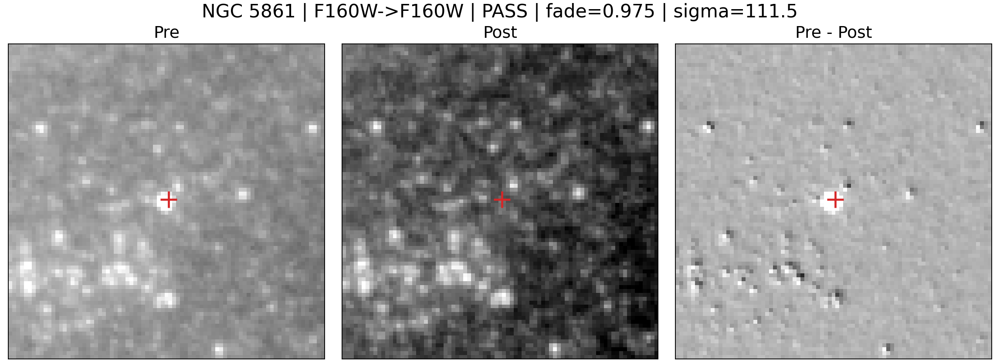

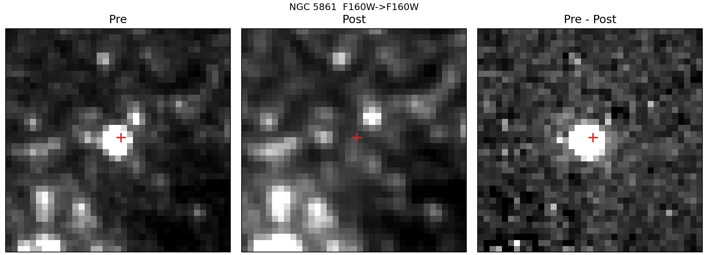

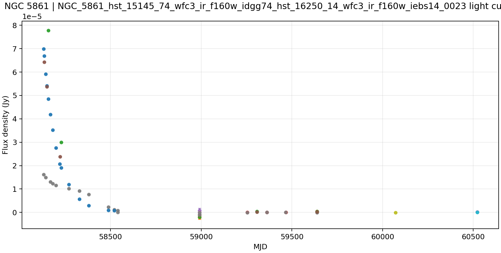

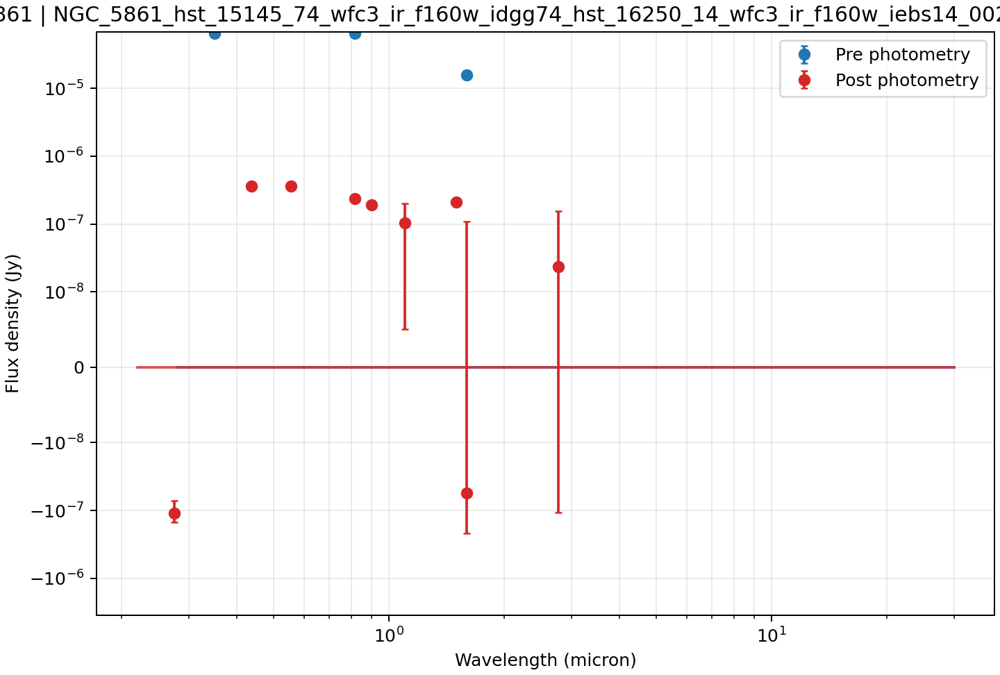

### `NGC 5861` `PASS` object B

Candidate: `NGC_5861_hst_15145_78_wfc3_ir_f160w_idgg78_hst_16250_14_wfc3_ir_f160w_iebs14_0025`. Filter pair: `F160W -> F160W`. Baseline: `1456.6` days. Fade: `97.06%`. Significance: `82.81 sigma`. Priority: `71.27`.


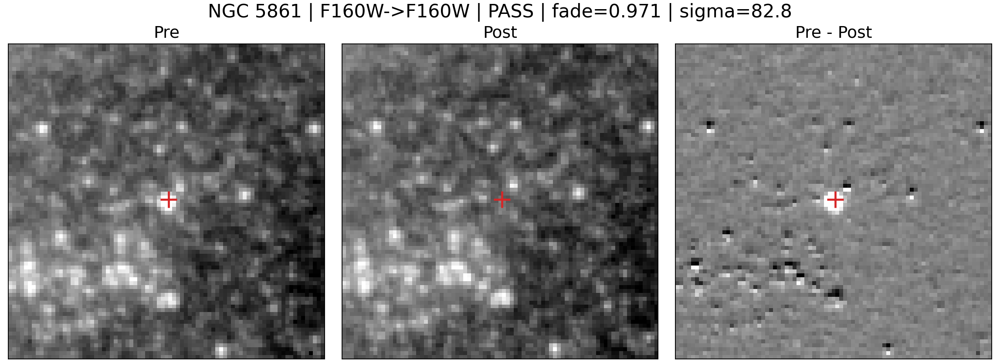

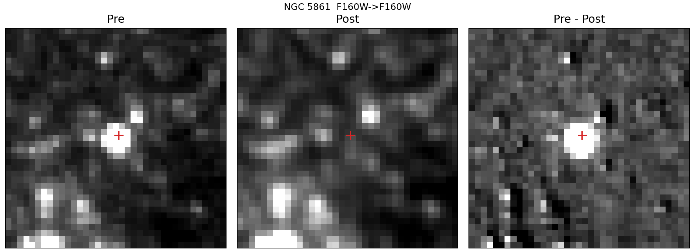

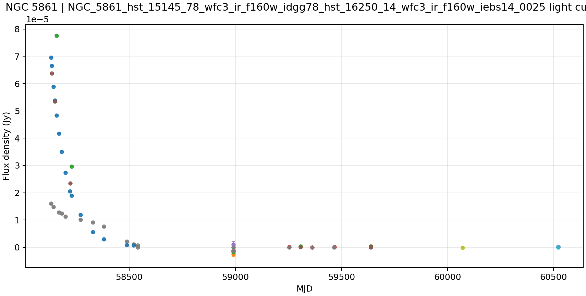

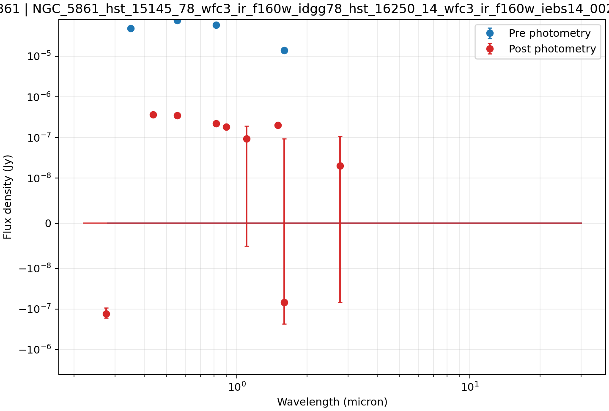

### `MESSIER 101` `PASS` object

Candidate: `MESSIER_101_hst_9490_02_acs_wfc_f555w_j8d602_hst_14678_01_acs_wfc_f555w_jd6v01_0003`. Filter pair: `F555W -> F555W`. Baseline: `5328.0` days. Fade: `99.99%`. Significance: `12.62 sigma`. Priority: `21.59`.


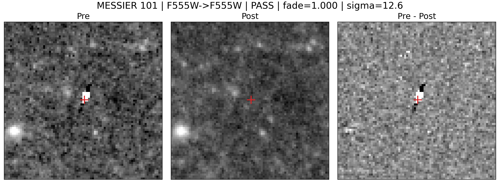

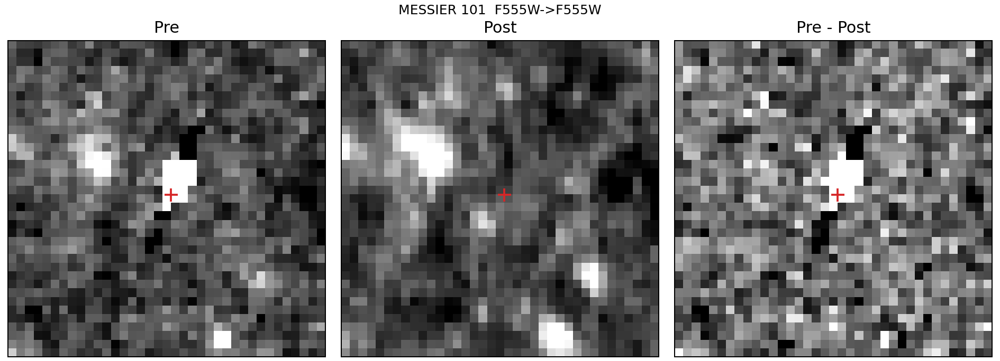

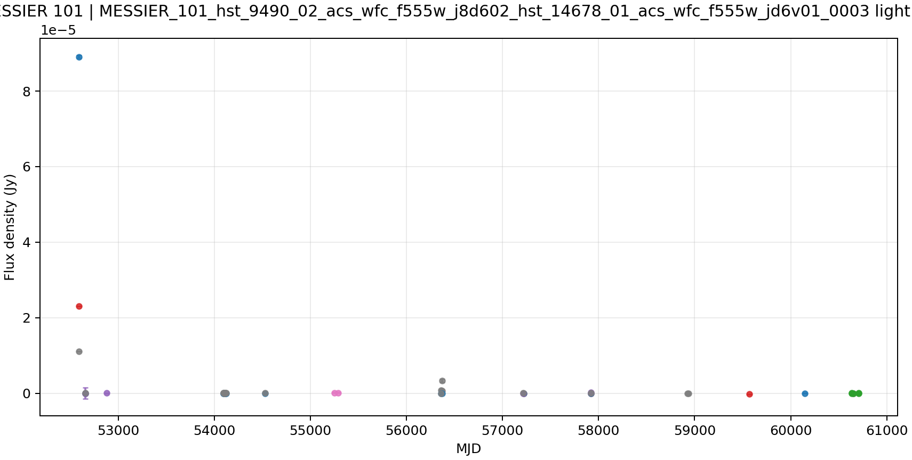

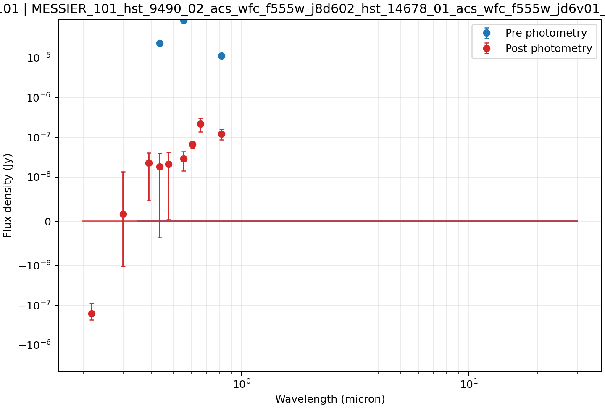

## Candidate gallery

Every surviving ledger entry is shown below with the same three artifacts: animated blink, overview panel, and packet cutout.

### PASS candidates

<details>
<summary><code>NGC_5861_hst_15145_74_wfc3_ir_f160w_idgg74_hst_16250_14_wfc3_ir_f160w_iebs14_0023</code> | PASS | NGC 5861 | F160W -> F160W | 1494.5 days | fade 97.49% | 111.45 sigma | priority 91.48</summary>

Galaxy: `NGC 5861`. Filter pair: `F160W -> F160W`. Baseline: `1494.5` days. Fade: `97.49%`. Significance: `111.45 sigma`. Priority: `91.48`.


</details>

<details>
<summary><code>NGC_5861_hst_15145_78_wfc3_ir_f160w_idgg78_hst_16250_14_wfc3_ir_f160w_iebs14_0025</code> | PASS | NGC 5861 | F160W -> F160W | 1456.6 days | fade 97.06% | 82.81 sigma | priority 71.27</summary>

Galaxy: `NGC 5861`. Filter pair: `F160W -> F160W`. Baseline: `1456.6` days. Fade: `97.06%`. Significance: `82.81 sigma`. Priority: `71.27`.


</details>

<details>
<summary><code>MESSIER_101_hst_9490_02_acs_wfc_f555w_j8d602_hst_14678_01_acs_wfc_f555w_jd6v01_0003</code> | PASS | MESSIER 101 | F555W -> F555W | 5328.0 days | fade 99.99% | 12.62 sigma | priority 21.59</summary>

Galaxy: `MESSIER 101`. Filter pair: `F555W -> F555W`. Baseline: `5328.0` days. Fade: `99.99%`. Significance: `12.62 sigma`. Priority: `21.59`.


</details>

### REVIEW candidates

<details>
<summary><code>MESSIER_101_hst_9490_02_acs_wfc_f555w_j8d602_hst_14678_01_acs_wfc_f555w_jd6v01_1397</code> | REVIEW | MESSIER 101 | F555W -> F555W | 5328.0 days | fade 67.15% | 65.65 sigma | priority 61.10</summary>

Galaxy: `MESSIER 101`. Filter pair: `F555W -> F555W`. Baseline: `5328.0` days. Fade: `67.15%`. Significance: `65.65 sigma`. Priority: `61.10`.


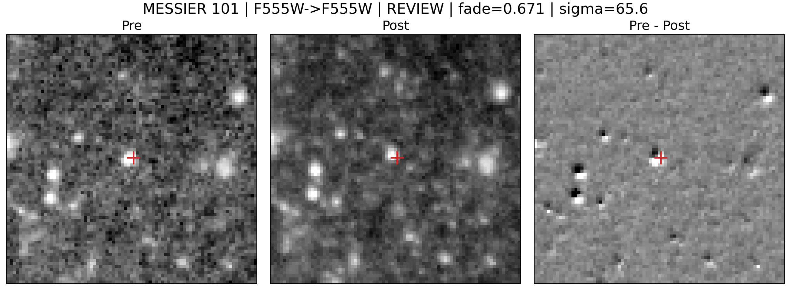

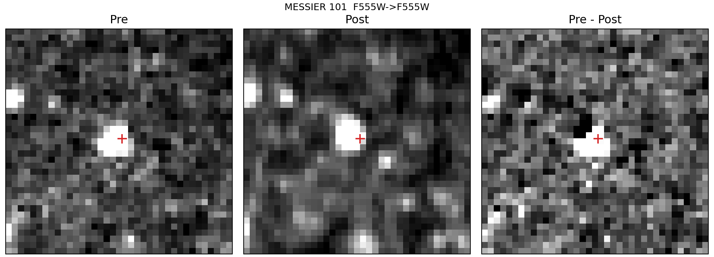
</details>

<details>
<summary><code>MESSIER_101_hst_9490_02_acs_wfc_f555w_j8d602_hst_14678_01_acs_wfc_f555w_jd6v01_1314</code> | REVIEW | MESSIER 101 | F555W -> F555W | 5328.0 days | fade 90.88% | 52.14 sigma | priority 57.37</summary>

Galaxy: `MESSIER 101`. Filter pair: `F555W -> F555W`. Baseline: `5328.0` days. Fade: `90.88%`. Significance: `52.14 sigma`. Priority: `57.37`.

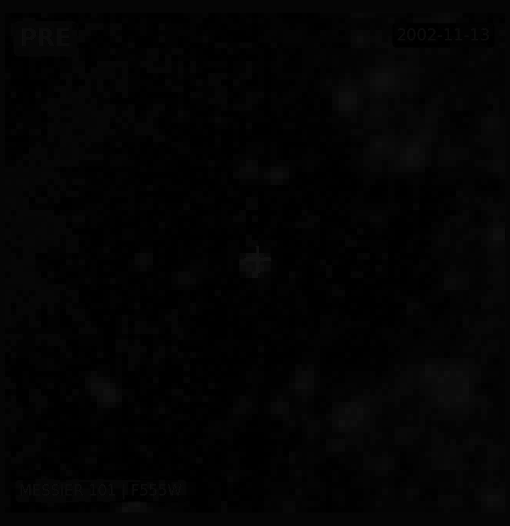

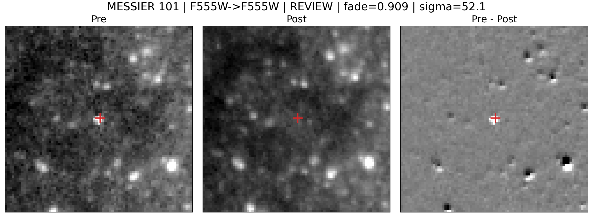

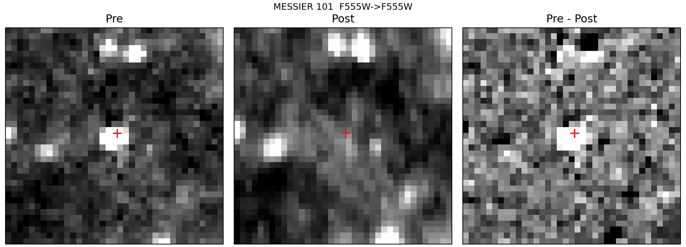
</details>

<details>
<summary><code>MESSIER_077_hst_15151_04_wfc3_uvis_f814w_idm104_hst_17502_01_wfc3_uvis_f814w_ifab01_0257</code> | REVIEW | MESSIER 077 | F814W -> F814W | 1904.6 days | fade 64.53% | 69.69 sigma | priority 45.23</summary>

Galaxy: `MESSIER 077`. Filter pair: `F814W -> F814W`. Baseline: `1904.6` days. Fade: `64.53%`. Significance: `69.69 sigma`. Priority: `45.23`.


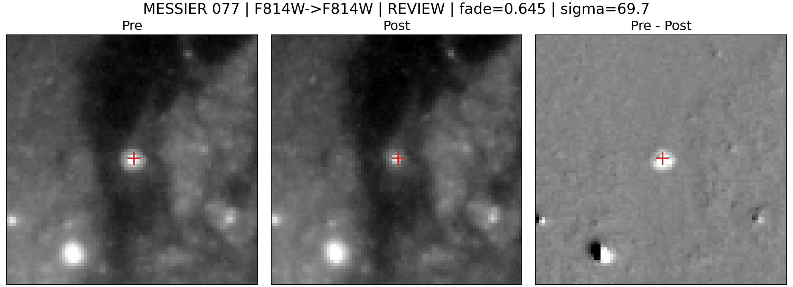

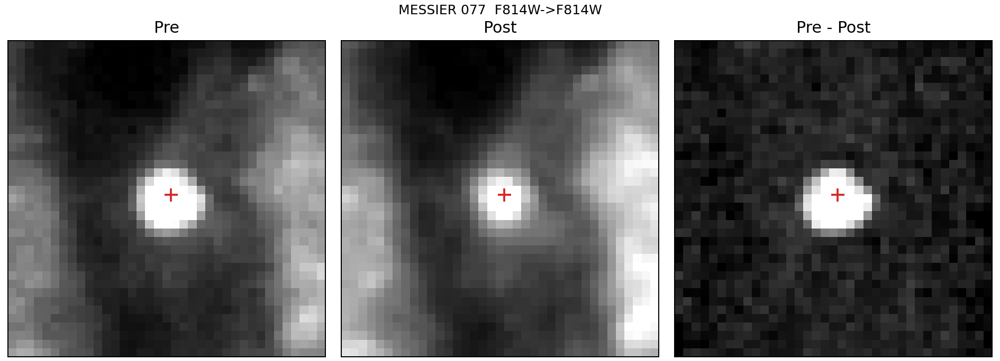
</details>

<details>
<summary><code>MESSIER_066_hst_12968_01_wfc3_uvis_f438w_ic0h01_hst_15654_22_wfc3_uvis_f438w_idxr22_0217</code> | REVIEW | MESSIER 066 | F438W -> F438W | 2203.7 days | fade 54.32% | 58.02 sigma | priority 21.90</summary>

Galaxy: `MESSIER 066`. Filter pair: `F438W -> F438W`. Baseline: `2203.7` days. Fade: `54.32%`. Significance: `58.02 sigma`. Priority: `21.90`.

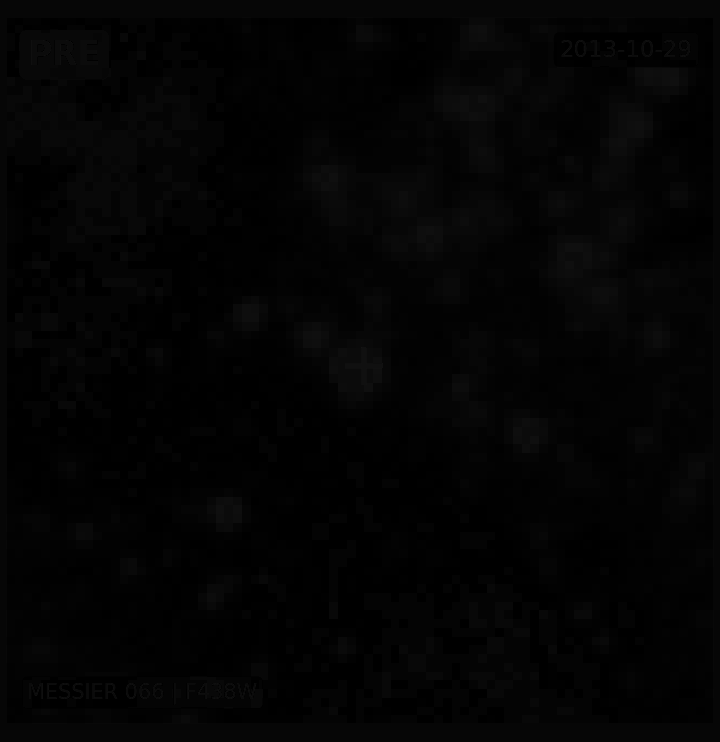

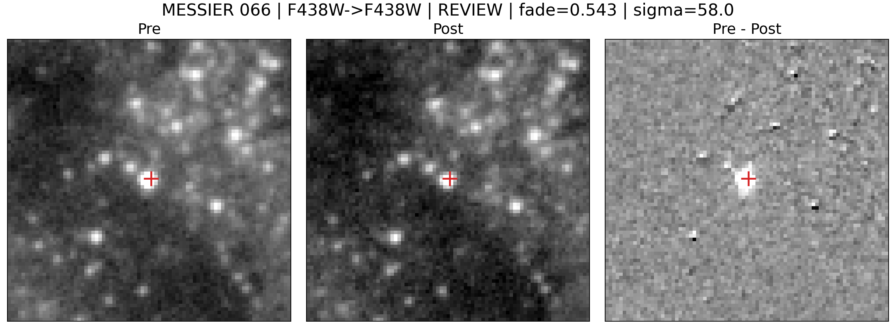

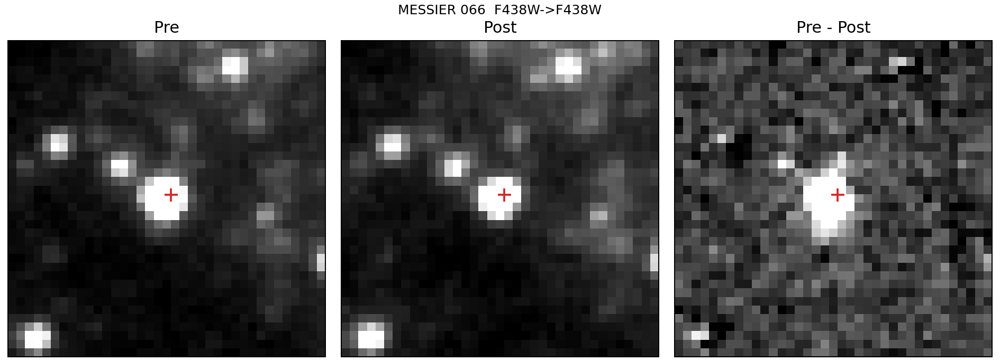
</details>

<details>
<summary><code>MESSIER_101_hst_9490_02_acs_wfc_f555w_j8d602_hst_14678_01_acs_wfc_f555w_jd6v01_0449</code> | REVIEW | MESSIER 101 | F555W -> F555W | 5328.0 days | fade 68.11% | 45.82 sigma | priority 19.27</summary>

Galaxy: `MESSIER 101`. Filter pair: `F555W -> F555W`. Baseline: `5328.0` days. Fade: `68.11%`. Significance: `45.82 sigma`. Priority: `19.27`.


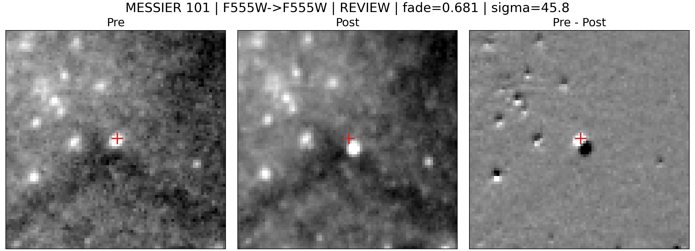

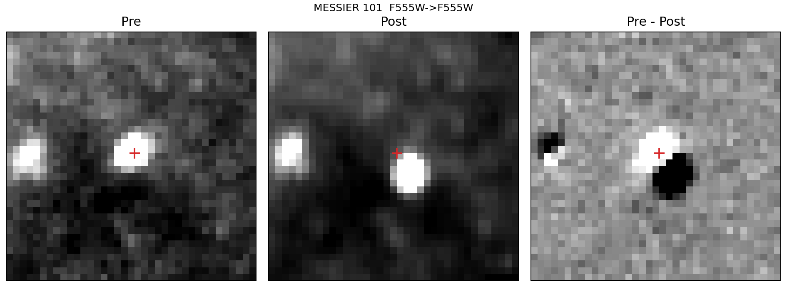
</details>

<details>
<summary><code>MESSIER_101_hst_9490_02_acs_wfc_f555w_j8d602_hst_14678_01_acs_wfc_f555w_jd6v01_0225</code> | REVIEW | MESSIER 101 | F555W -> F555W | 5328.0 days | fade 87.09% | 35.36 sigma | priority 15.28</summary>

Galaxy: `MESSIER 101`. Filter pair: `F555W -> F555W`. Baseline: `5328.0` days. Fade: `87.09%`. Significance: `35.36 sigma`. Priority: `15.28`.

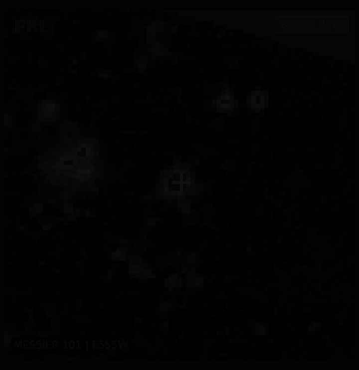

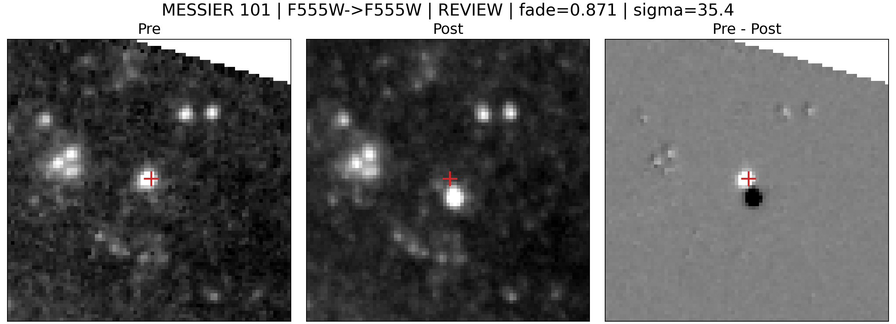

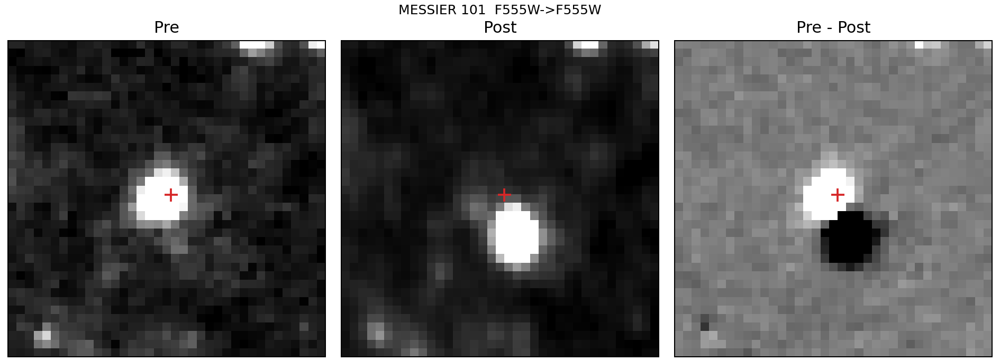
</details>

<details>
<summary><code>MESSIER_066_hst_12968_01_wfc3_uvis_f814w_ic0h01_hst_15654_22_wfc3_uvis_f814w_idxr22_0091</code> | REVIEW | MESSIER 066 | F814W -> F814W | 2203.6 days | fade 68.01% | 33.14 sigma | priority 13.37</summary>

Galaxy: `MESSIER 066`. Filter pair: `F814W -> F814W`. Baseline: `2203.6` days. Fade: `68.01%`. Significance: `33.14 sigma`. Priority: `13.37`.

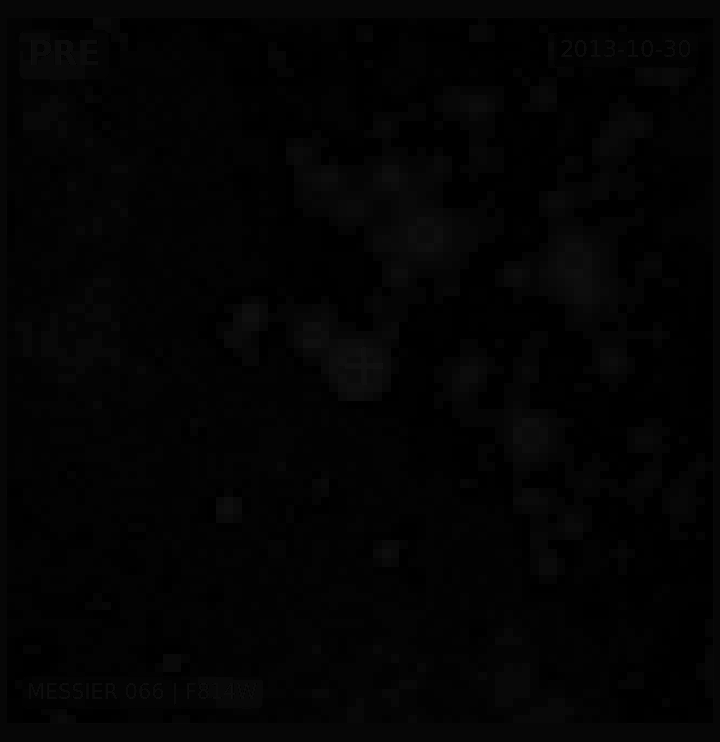

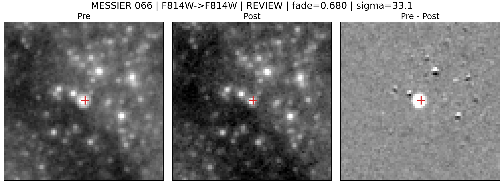

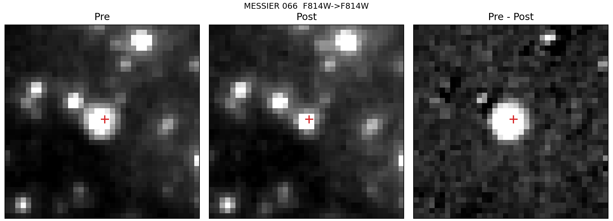
</details>

<details>
<summary><code>MESSIER_101_hst_9490_02_acs_wfc_f555w_j8d602_hst_14678_01_acs_wfc_f555w_jd6v01_0008</code> | REVIEW | MESSIER 101 | F555W -> F555W | 5328.0 days | fade 100.12% | 983.42 sigma | priority 7.50</summary>

Galaxy: `MESSIER 101`. Filter pair: `F555W -> F555W`. Baseline: `5328.0` days. Fade: `100.12%`. Significance: `983.42 sigma`. Priority: `7.50`.


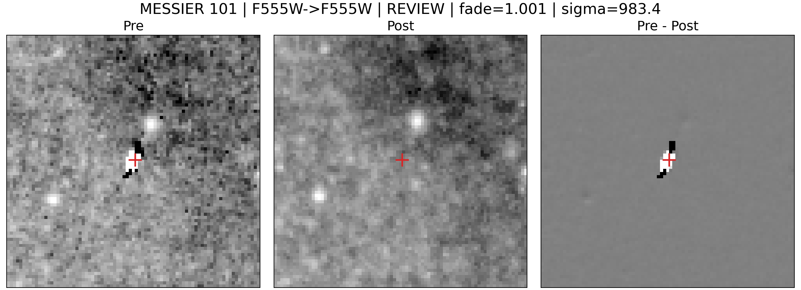

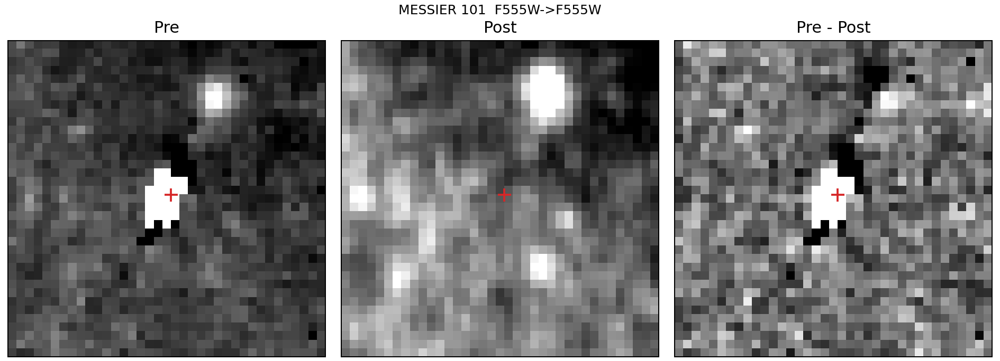
</details>

<details>
<summary><code>6dF_J0245599-073443_hst_11575_02_acs_wfc_f814w_jb4u02_hst_14226_01_acs_wfc_f814w_jcuc01_0061</code> | REVIEW | 6dF J0245599-073443 | F814W -> F814W | 2139.9 days | fade 59.91% | 10.53 sigma | priority 7.44</summary>

Galaxy: `6dF J0245599-073443`. Filter pair: `F814W -> F814W`. Baseline: `2139.9` days. Fade: `59.91%`. Significance: `10.53 sigma`. Priority: `7.44`.

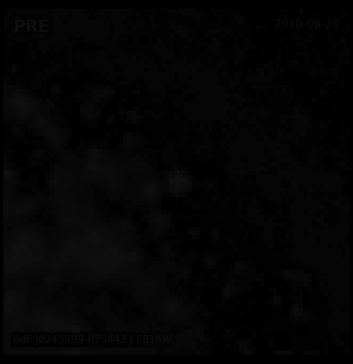

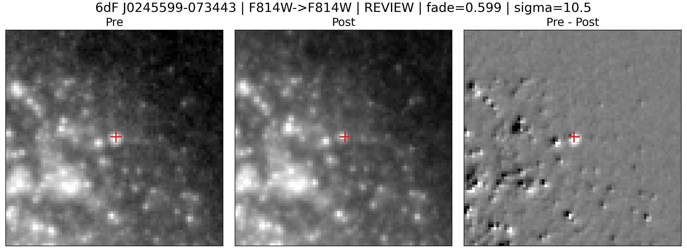

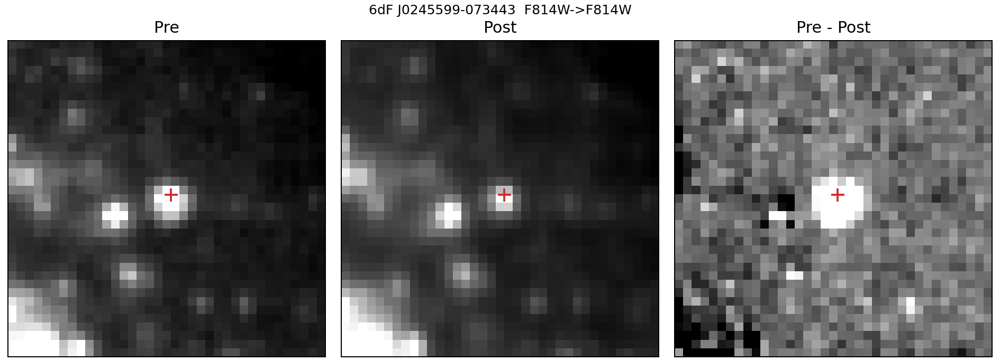
</details>

<details>
<summary><code>6dF_J0245599-073443_hst_11575_02_acs_wfc_f814w_jb4u02_hst_14226_01_acs_wfc_f814w_jcuc01_0002</code> | REVIEW | 6dF J0245599-073443 | F814W -> F814W | 2139.9 days | fade 58.29% | 11.36 sigma | priority 5.72</summary>

Galaxy: `6dF J0245599-073443`. Filter pair: `F814W -> F814W`. Baseline: `2139.9` days. Fade: `58.29%`. Significance: `11.36 sigma`. Priority: `5.72`.

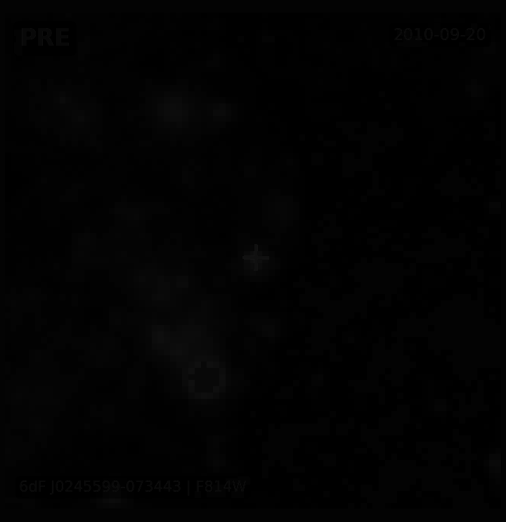

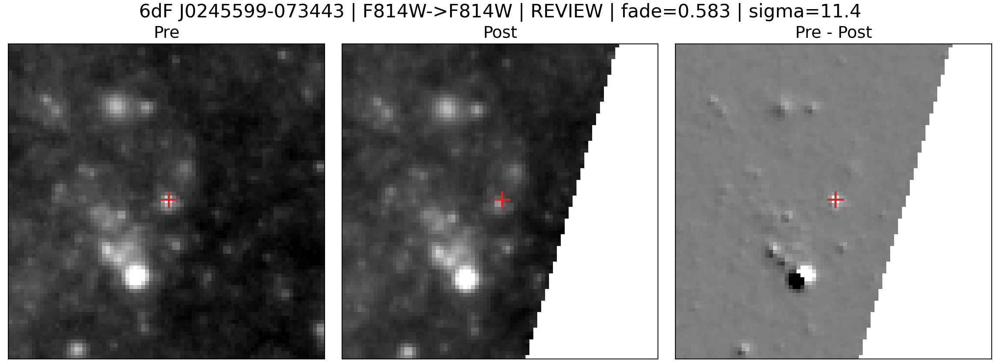

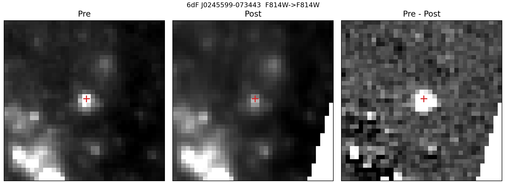
</details>

<details>
<summary><code>MESSIER_101_hst_9490_02_acs_wfc_f555w_j8d602_hst_14678_01_acs_wfc_f555w_jd6v01_1266</code> | REVIEW | MESSIER 101 | F555W -> F555W | 5328.0 days | fade 117.68% | 11.97 sigma | priority 5.42</summary>

Galaxy: `MESSIER 101`. Filter pair: `F555W -> F555W`. Baseline: `5328.0` days. Fade: `117.68%`. Significance: `11.97 sigma`. Priority: `5.42`.


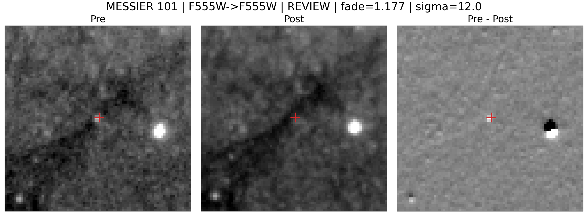

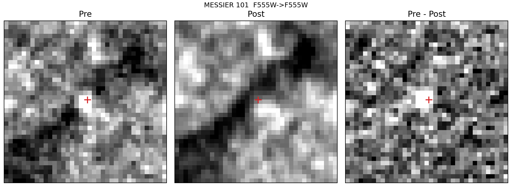
</details>

<details>
<summary><code>MESSIER_101_hst_9490_02_acs_wfc_f555w_j8d602_hst_14678_01_acs_wfc_f555w_jd6v01_1482</code> | REVIEW | MESSIER 101 | F555W -> F555W | 5328.0 days | fade 66.55% | 7.55 sigma | priority 2.41</summary>

Galaxy: `MESSIER 101`. Filter pair: `F555W -> F555W`. Baseline: `5328.0` days. Fade: `66.55%`. Significance: `7.55 sigma`. Priority: `2.41`.


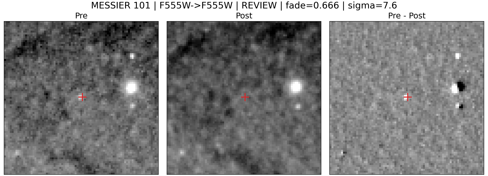

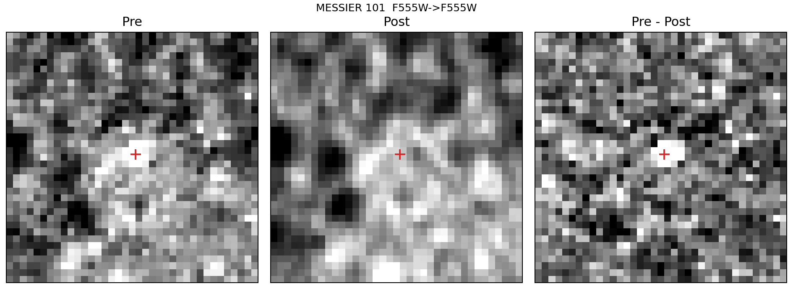
</details>

<details>
<summary><code>MESSIER_077_hst_15151_04_wfc3_uvis_f555w_idm104_hst_17502_01_wfc3_uvis_f555w_ifab01_0138</code> | REVIEW | MESSIER 077 | F555W -> F555W | 1904.6 days | fade 56.57% | 15.17 sigma | priority 2.37</summary>

Galaxy: `MESSIER 077`. Filter pair: `F555W -> F555W`. Baseline: `1904.6` days. Fade: `56.57%`. Significance: `15.17 sigma`. Priority: `2.37`.


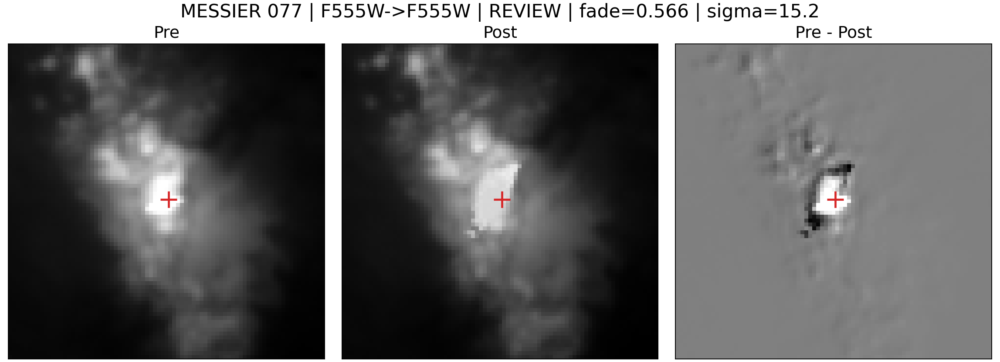

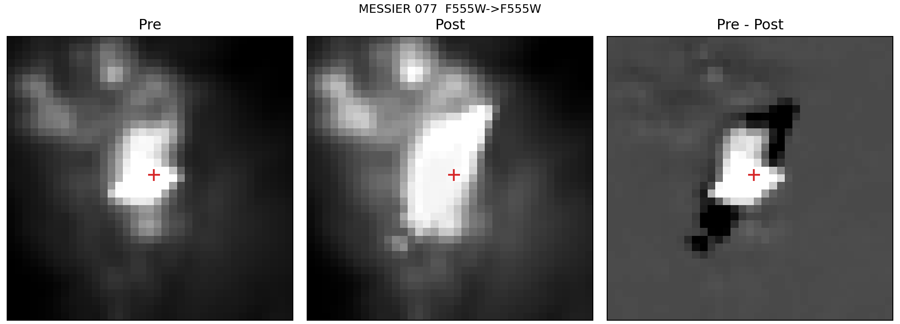
</details>

<details>
<summary><code>MESSIER_061_hst_skycell-p1458x13y04_acs_wfc_f814w_all_hst_12574_01_acs_wfc_f814w_jbs801_0033</code> | REVIEW | MESSIER 061 | F814W -> F814W | 3368.4 days | fade 64.34% | 5.88 sigma | priority 2.08</summary>

Galaxy: `MESSIER 061`. Filter pair: `F814W -> F814W`. Baseline: `3368.4` days. Fade: `64.34%`. Significance: `5.88 sigma`. Priority: `2.08`.


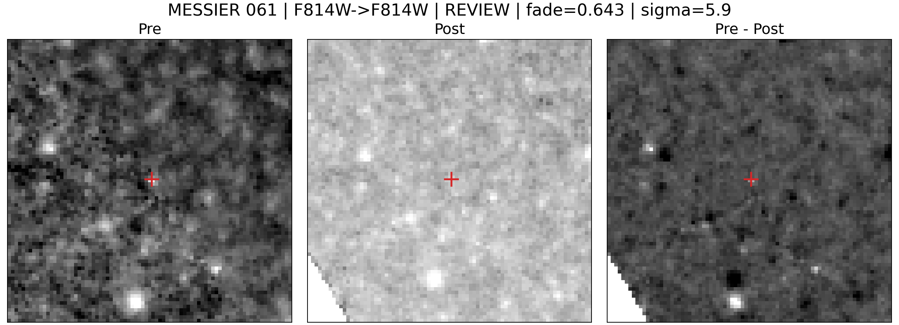

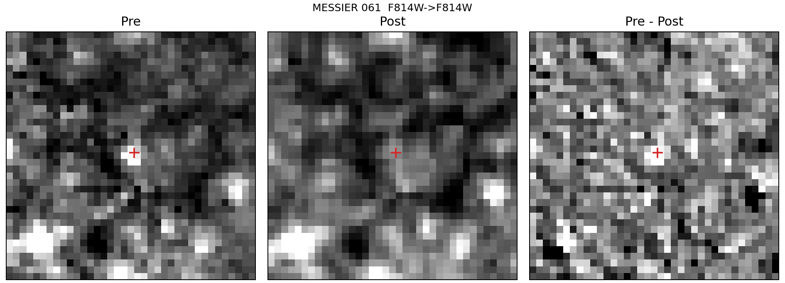
</details>

<details>
<summary><code>NGC_5728_hst_15640_21_wfc3_ir_f160w_idxb21_hst_15640_2b_wfc3_ir_f160w_idxb2b_0137</code> | REVIEW | NGC 5728 | F160W -> F160W | 104.5 days | fade 43.78% | 5.38 sigma | priority 0.03</summary>

Galaxy: `NGC 5728`. Filter pair: `F160W -> F160W`. Baseline: `104.5` days. Fade: `43.78%`. Significance: `5.38 sigma`. Priority: `0.03`.

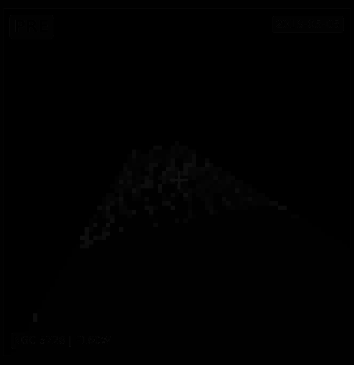

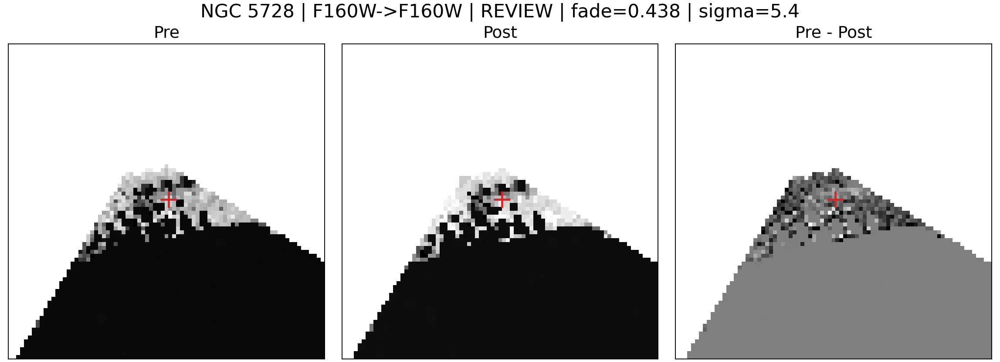

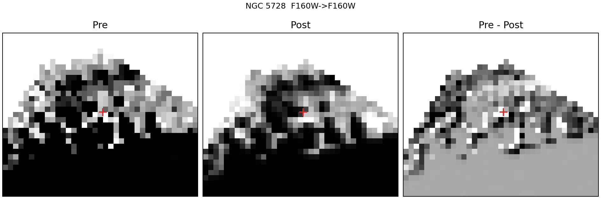
</details>

## Reproduce the pipeline

```bash
python3 -m venv .venv
./.venv/bin/pip install -e .
./.venv/bin/supernova-mission run-pilot --top-n 130 --archive-top-n 25
```

For the current expanded discovery stage:

```bash
./.venv/bin/supernova-mission build-archive \
  --archive-top-n 130 \
  --radius-deg 0.05 \
  --min-baseline-days 30

./.venv/bin/supernova-mission run-pixel-search \
  --epoch-pairs-path archive/epoch_pairs.parquet \
  --observation-matrix-path archive/observation_matrix.parquet \
  --max-pairs 113 \
  --per-galaxy 3 \
  --compatibilities exact \
  --same-collection-only \
  --max-workers 4

./.venv/bin/supernova-mission run-followup \
  --candidate-ledger-path candidates/candidate_ledger.parquet \
  --observation-matrix-path archive/observation_matrix.parquet \
  --galaxy-master-path catalogs/galaxy_master.parquet \
  --statuses PASS \
  --max-workers 4
```

## Key outputs

- `catalogs/galaxy_master.parquet`
- `catalogs/galaxy_scores.parquet`
- `catalogs/galaxy_exclusions.csv.gz`
- `archive/observation_matrix.parquet`
- `archive/epoch_pairs.parquet`
- `archive/archive_failures.csv`
- `candidates/candidate_ledger.parquet`
- `candidates/review_queue.csv`
- `candidate_packets/`
- `figures/candidates/`
- `sed/`

## Notes

- The raw `data/cache/` download cache is intentionally not versioned because it is large and mostly reproducible from MAST.
- `catalogs/galaxy_exclusions.csv` is preserved in compressed form as `catalogs/galaxy_exclusions.csv.gz` to stay within normal GitHub file-size limits.
- The ledger is the authoritative current candidate list for the gallery above; follow-up products are still being written by the active `run-followup` stage.
