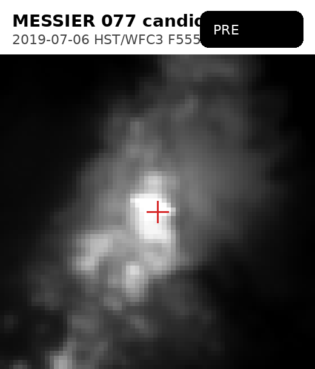
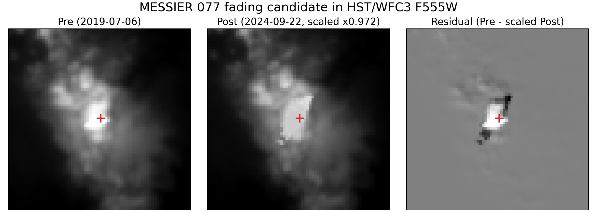
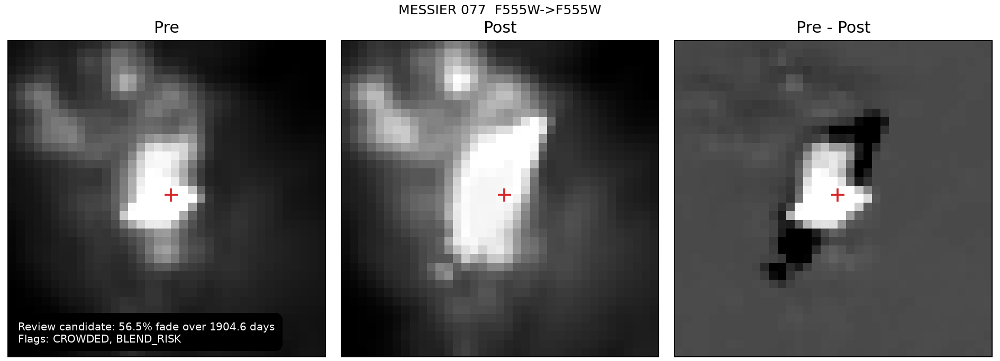

# SUPERNOVA

Archival failed-supernova / disappearing-star search workspace built around Ryan's JWST proposal and extended into a live HST/JWST pilot pipeline.

## What this repo contains

- The proposal and science framing in `JWST_Failed_SNe_Cycle_5.pdf`, `super_plan.md`, and `super_report.md`
- A runnable Python package in `src/supernova_pipeline/`
- Derived catalog, archive, and candidate products from the current pilot run
- Visual review artifacts for the strongest surviving object

## Current status

The pilot search is past planning and archive inventory. It has already run a conservative pixel-level scan over prioritized HST/JWST epoch pairs.

- Nearby-galaxy master catalog: `12,419` search-eligible systems
- Archive pilot: `1,052` observations and `34,233` matched epoch pairs
- Pixel search pilot: `11` pairs selected, `9` scanned, `4,329` sources measured
- Surviving candidates: `0` `PASS`, `1` `REVIEW`

The surviving review object is in `MESSIER 077`, observed with HST/WFC3 in `F555W`, with a measured fade of about `56.5%` over `1904.6` days. It remains a review object rather than a claim because it is flagged `CROWDED` and `BLEND_RISK`.

## Candidate blink

Animated blink of the surviving `MESSIER 077` review candidate, using the two aligned HST/WFC3 `F555W` epochs:



## Candidate panel

Static review panel showing the pre image, the scaled post image, and the residual:



Annotated packet figure from the review queue:



## Reproduce the pipeline

```bash
python3 -m venv .venv
./.venv/bin/pip install -e .
./.venv/bin/supernova-mission run-pilot --top-n 130 --archive-top-n 25
```

For the current pixel-search stage specifically:

```bash
./.venv/bin/supernova-mission run-pixel-search \
  --epoch-pairs-path archive/epoch_pairs.parquet \
  --observation-matrix-path archive/observation_matrix.parquet \
  --max-pairs 11 \
  --per-galaxy 1 \
  --compatibilities exact \
  --same-collection-only
```

## Key outputs

- `catalogs/galaxy_master.parquet`
- `catalogs/galaxy_scores.parquet`
- `catalogs/galaxy_exclusions.csv.gz`
- `archive/observation_matrix.parquet`
- `archive/epoch_pairs.parquet`
- `candidates/candidate_ledger.parquet`
- `candidates/review_queue.csv`
- `candidate_packets/`

## Notes

- The raw `data/cache/` download cache is intentionally not versioned because it is about `9 GB` and mostly reproducible from MAST.
- `catalogs/galaxy_exclusions.csv` is preserved in compressed form as `catalogs/galaxy_exclusions.csv.gz` to stay within normal GitHub file-size limits.
